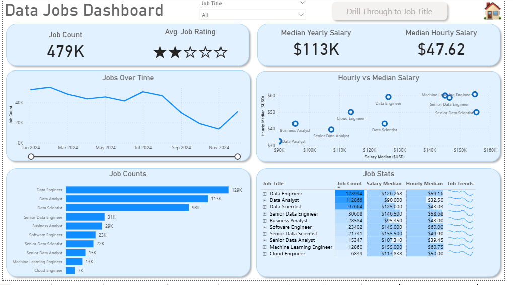
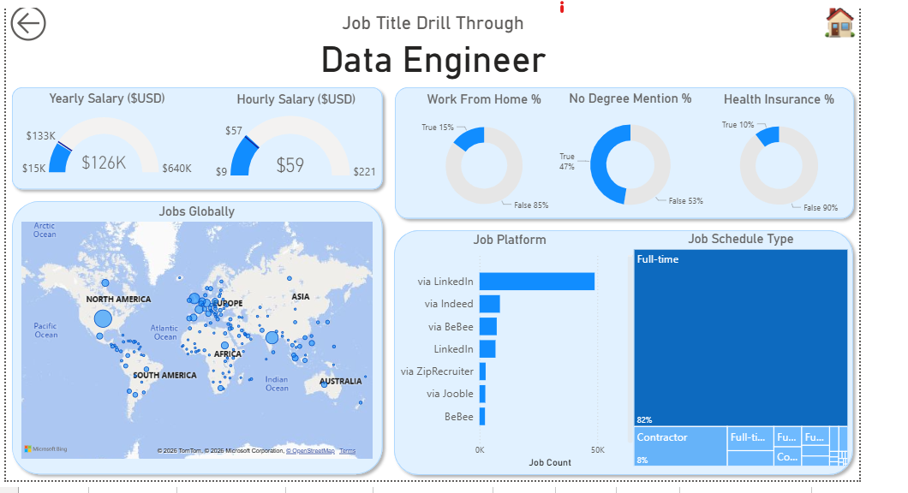
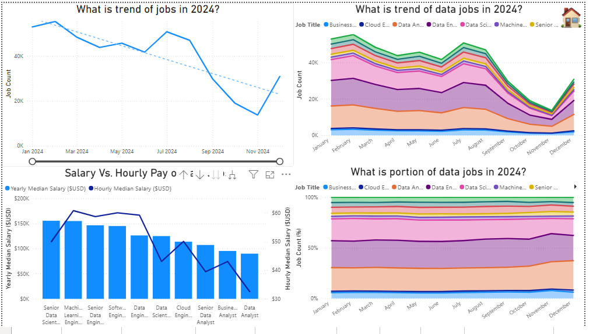
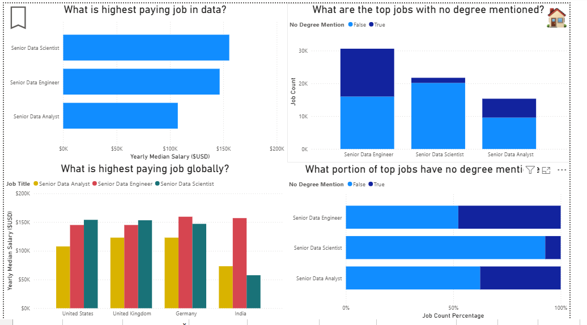
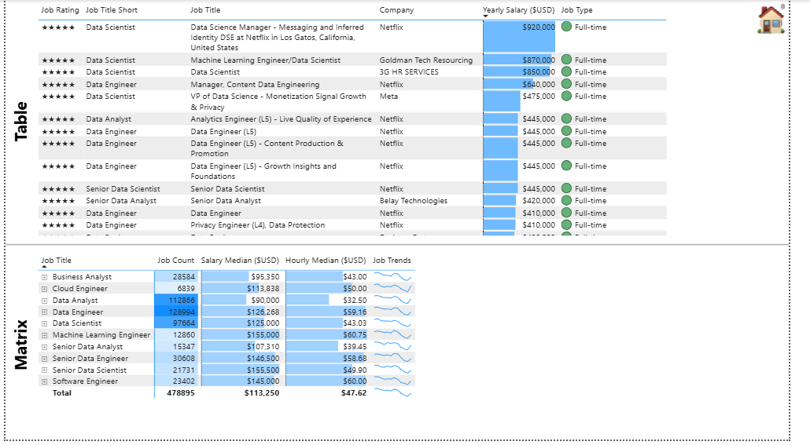
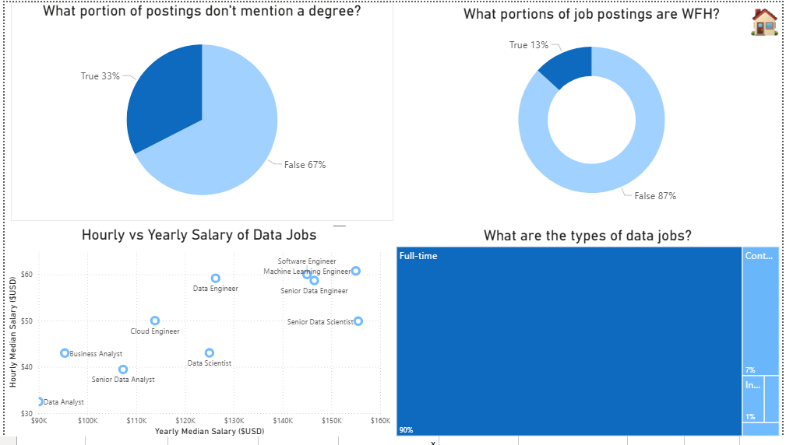

# Data Jobs Analysis

## Overview
This project explores trends in the data job market, focusing on roles such as Data Analysts and Data Scientists.

The analysis was built using Power BI to visualize key patterns in the industry.

---

## Objective
To understand job market trends, including roles, salaries, skills demand, and employment patterns in the data industry.

---
## 📊 Dashboard Preview

## Tools Used
- Power BI  
- Data visualization techniques  
- Data analysis and interpretation  

---

## Key Areas of Analysis
- Salary trends across data roles  
- Job role distribution  
- Remote vs on-site work trends  
- Geographic distribution of jobs  
- Skills demand in the industry  

---

## Key Insights
- Data Analyst roles are more widely available at entry level  
- Skill-based hiring is increasingly important  
- Remote work availability varies by role and company  
- Certain regions dominate data job opportunities  

---

## Outcome
This project provides a clear view of  how the data job market is structured and highlights opportunities for individuals entering the data field

